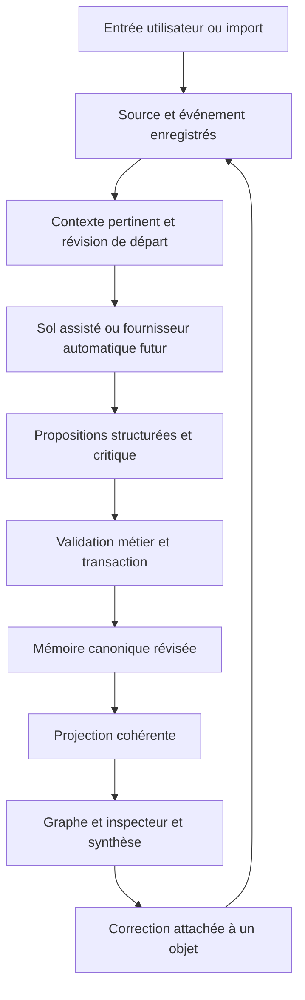

# MANWË Roadmap de reconstruction

Version 1.4 du 25 septembre 2026 : finalité prédictive et modèle stratégique au centre (D-017, D-018, [MODELE-STRATEGIQUE.md](./manwe-next/docs/pilotage/MODELE-STRATEGIQUE.md)). Version 1.3 du 24 septembre 2026 : mode développement à capacité maximale et nouveau pilotage (voir [PILOTAGE.md](./manwe-next/docs/pilotage/PILOTAGE.md), décisions D-006 et D-010). Version 1.2 du 23 septembre 2026. Cadrage initial et adaptation : Astra. Reprise de la réalisation et rôle de LLM provisoire : Sol, conformément à la décision utilisateur du 14 septembre. Validation de l'utilité et des choix d'expérience : utilisateur.

Nous reconstruisons le socle fonctionnel de MANWË à côté du prototype existant. Le premier résultat attendu est une application personnelle capable de conserver une situation sociale, de proposer une interprétation sourcée, de recevoir une correction et de représenter durablement cette révision dans le texte, le graphe et l'inspecteur.

Cette roadmap organise l'exécution de la vision V3.0. Elle modifie l'ordre de construction pour valider tôt une expérience complète. Les jalons R0 à R11 ci-dessous ne reprennent pas la numérotation M de la spécification et ne constituent pas des versions du modèle DeepSeek.

État actuel : UI de démonstration conservée et premier espace personnel relié à une mémoire SQLite transactionnelle ; intégration cognitive à construire. Les cases ne sont cochées que lorsque leurs preuves sont référencées.

### Point d’exécution — 25 septembre 2026

Mise à jour de la nuit : le BRIEF-003 est livré et le lot de contrôle R3-S02 passe : **R3 validé en mode automatique** ([RAPPORT-004](./manwe-next/docs/pilotage/rapports/RAPPORT-004.md)). Mise à jour du soir : R3-S01 est noté, **R3 non validé** ([RAPPORT-003](./manwe-next/docs/pilotage/rapports/RAPPORT-003.md)). Les évaluations passent en automatique avec DeepSeek V4.1-Flash (D-020) : un lot de 10 scénarios prend 4 minutes au lieu d'une journée d'allers-retours. Document de reprise pour toute nouvelle instance : [REPRISE.md](./manwe-next/docs/pilotage/REPRISE.md).

R2 est validé en mode assisté. Le moteur de révision R3 est livré : hypothèses de toutes profondeurs, preuves pour et contre, épisodes indépendants, passe critique, effets des annotations, questions. L'évaluation à l'aveugle R3-S01 est en cours. Le pilotage est assuré par Claude, qui code aussi en l'absence de l'exécutant (D-011).

Décisions structurantes issues des essais et des échanges avec l'utilisateur ([PILOTAGE.md](./manwe-next/docs/pilotage/PILOTAGE.md), [ONTOLOGIE.md](./manwe-next/docs/pilotage/ONTOLOGIE.md), [MODELE-STRATEGIQUE.md](./manwe-next/docs/pilotage/MODELE-STRATEGIQUE.md)) :

- **Finalité** : modéliser le monde de l'individu, prédire, trouver les leviers, tracer un chemin. L'étiquette diagnostique n'est pas le but (D-018).
- **Psychodynamique fine, essentielle** : c'est elle qui situe les leviers. Formulations mécanistes (ce qui est protégé, défenses, croyances, attachement, déclencheurs, ce qui apaise, ce que cela prédit) plutôt qu'étiquettes ; besoins, motifs, valeurs et mentalisation intégrés dès R3.9 et R4.0e (D-019).
- **Modèle stratégique, principe central** : le joueur est rationnel, c'est le jeu qui ne l'est pas. Chaque comportement est lu comme la meilleure solution trouvée par un système, souvent un minimum local, aux échelles intrapersonnelle, relationnelle et de groupe. Pour chaque acteur : ce qu'il optimise, ses croyances, la barrière qui le maintient, le jeu avec les autres, ses réponses prédites (D-017).
- **La relation devient un objet à part entière** (D-012). C'est un manque de la reconstruction par rapport à la spécification §11.
- **Rôles souples** : extraits par épisode, et au niveau de la relation seulement sous forme d'hypothèse. Le timing n'est pas exigé (D-013).
- **Registre ontologique unique** sur le modèle de l'Ontologie Palantir, dont découle le graphe R4 (D-014).
- **Conclure plutôt qu'énumérer** : lecture principale classée, alternatives qui sont de vrais mécanismes concurrents, « plausible » possible dès la première analyse en D1 et D2, confiance plafonnée au lieu d'un rejet (D-015).
- **Boucle d'action dans le monde réel** : objectif, pistes, action validée, résultat observé (D-016).

### Point d’exécution — 23 septembre 2026

À la demande de commencer par l’UI, `manwe-next/` conserve une interface React/TypeScript indépendante : graphe contextuel, inspecteur sourcé, vues Personnes / Intentions / Mémoire et recherche. Elle possède désormais deux espaces séparés : démonstration fictive et mémoire personnelle SQLite via un service Node local (ports 5180/5181). Le lanceur dédié démarre les deux ; le prototype et son lanceur sont conservés.

R1 est validé : captures littérales, dates, corrections, recherche, révisions, sauvegarde/restauration et corpus de vingt récits passent les contrôles. Le transport Sol assisté de R2 est en cours : paquet JSON, import, aperçu et application transactionnelle existent pour deux opérations ; trois sorties Sol assistées ont passé le harnais sur la négation, le conditionnel et le propos rapporté. Elles ne sont ni aveugles ni automatiques. DeepSeek, le harnais et le shell Windows empaqueté ne sont pas intégrés. Périmètre et vérifications : `manwe-next/README.md`, `manwe-next/docs/milestones/R1-MEMORY.md` et `manwe-next/docs/milestones/R2-FOUNDATION.md`.

### Décision de reprise — Sol comme LLM pendant la réalisation

Sol assurera deux rôles distincts : construire le logiciel et, dans des tours d'analyse identifiés, produire les propositions cognitives à partir du contexte exporté par MANWË. Ces propositions passeront par les mêmes validations métier que celles d'un fournisseur automatique futur. Sol ne modifiera pas directement la mémoire pour simuler une analyse réussie.

Le mode retenu est **assisté**, par échange explicite de fichiers JSON : aucune connexion automatique à cette conversation, aucune nouvelle tâche ni exécution de fond n'est créée par cette décision. DeepSeek et son harnais restent une intégration ultérieure, isolée derrière le contrat fournisseur. Les jalons R2 à R5 peuvent être validés dans le périmètre assisté ; l'automatisation possède son propre contrôle `IA-A`, obligatoire avant l'alpha R6.

Documents de reprise : [handoff pour Sol](./manwe-next/docs/HANDOFF_SOL.md), [décision d'architecture](./manwe-next/docs/decisions/0001-sol-assisted-cognition.md), [contrat cognitif v1 à implémenter](./manwe-next/docs/contracts/COGNITION_V1.md). Ce sont des spécifications de construction, pas l'annonce de fonctions déjà branchées.

## 1 Le résultat que nous voulons prouver

La finalité de MANWË est de modéliser le monde dans lequel évolue l'individu, de prédire comment il répondra, d'identifier les leviers et de tracer un chemin. L'étiquette diagnostique n'est pas le but : beaucoup de personnes sont détruites faute d'avoir vu un chemin, et c'est ce manque que la prothèse doit combler (D-018). La profondeur, elle, est essentielle : c'est la modélisation psychodynamique fine des individus qui situe les leviers et permet d'agir (D-019). Le moteur de cette prédiction est le modèle stratégique : le joueur est rationnel, c'est le jeu qui ne l'est pas (D-017, [MODELE-STRATEGIQUE.md](./manwe-next/docs/pilotage/MODELE-STRATEGIQUE.md)).

La question de validation est : « MANWË m'aide-t-il à comprendre une situation, à distinguer ce qui est établi de ce qui est supposé, et à corriger une représentation qui continue de tenir compte de mes corrections demain ? »

Le premier périmètre fonctionnel comprend l'utilisateur, trois personnes, un groupe, dix à trente événements, une relation centrale, un problème, un objectif, des hypothèses concurrentes à toutes les profondeurs (dont deux mises en avant dans la vue) et au moins une question ouverte pertinente. Les données de démonstration restent identifiées comme telles ; un espace personnel démarre vide.

Le scénario de référence suit cette séquence :

1. Raconter ou importer quelques événements avec leurs dates et leurs sources.
2. Retrouver séparément les comportements rapportés, les déclarations et les impressions.
3. Examiner une hypothèse et une explication concurrente dans le graphe.
4. Descendre jusqu'aux extraits qui étayent ou affaiblissent chaque hypothèse.
5. Ajouter du contexte ou contester une interprétation sur l'objet concerné.
6. Répondre à une question qui distingue les explications, ou conserver « je ne sais pas ».
7. Voir la révision cohérente du texte, de l'inspecteur et du graphe.
8. Fermer complètement l'application, la rouvrir et retrouver cette révision.
9. Faire émerger un objectif et comparer deux directions possibles.

## 2 Point de départ et stratégie de reprise

L'audit du 13 septembre a porté sur les sources du prototype, son intégration DeepSeek et les documents de conception. Le contrôle TypeScript est passé. Il ne constitue pas une validation fonctionnelle du produit.

| Élément actuel                         | Constat                                                                            | Traitement prévu                                                              |
| -------------------------------------- | ---------------------------------------------------------------------------------- | ----------------------------------------------------------------------------- |
| Vision UX et spécification             | Intention produit explicite, provenance et révision centrales                      | Conserver comme références, tracer les arbitrages                             |
| Styles, grammaire visuelle, inspecteur | Base exploitable pour une interface personnelle                                    | Réutiliser progressivement après découplage des données fictives              |
| Graphe SVG                             | Positions, relations et focus liés au scénario Marc                                | Conserver l'expérience visuelle ; reconstruire la projection et ses entrées   |
| État React                             | Données de démonstration et transitions en mémoire                                 | Remplacer par un état métier persistant ; React garde seulement l'état de vue |
| Analyse du texte                       | Règle par mots-clés déclenchant une invitation même dans une négation              | Réserver les simulations aux tests et démonstrations explicites               |
| Réponse DeepSeek                       | Seule la synthèse est exploitée ; pas de contexte social réel transmis             | Reconstruire la récupération du contexte et l'application des changements     |
| Harnais et SDK                         | Installation et handshake validés le 31 août ; aucun parcours métier réel démontré | Revalider la compatibilité puis intégrer des outils MANWË                     |
| Chaîne de lancement web                | Vinext, Wrangler et configuration Sites dans le prototype                          | Ne pas en faire une dépendance du nouveau produit Windows personnel           |
| Fichiers locaux et modifications Git   | Plusieurs changements non commités                                                 | Inventorier et sauvegarder avant migration, ne rien perdre                    |

Le dossier de reconstruction est `manwe-next/`, voisin de `manwe-prototype/`. Il contient déjà l'UI, mais R0 reste à compléter, notamment le suivi Git propre et la faisabilité Windows. Le prototype et ses lanceurs restent disponibles pendant la reconstruction. La bascule du lanceur principal intervient à R6 après validation ; aucune suppression du prototype n'est nécessaire pour avancer.

## 3 Décisions structurantes

### 3.1 Une seule mémoire métier

Le backend possède l'état canonique. Le texte, le graphe, les fiches, l'inspecteur et les projections Markdown se rapportent à une même révision de cet état.

Le modèle propose une interprétation ou un ensemble de changements structurés. L'application vérifie les références, les types, les permissions et la révision de départ avant de les enregistrer. Un schéma JSON valide prouve la forme d'une sortie, jamais la vérité de son contenu.

Une correction est une donnée durable attachée à un objet. Elle peut modifier un événement rapporté, réviser une hypothèse ou exprimer un désaccord ; ces actions ont des effets distincts.

### 3.2 Un service personnel et des modules explicites

Nous partons d'un backend local unique avec des modules de domaine, de stockage, de cognition, de projection et d'intégration. Leur séparation permet les tests et le remplacement des adaptateurs. Elle ne nécessite pas de multiplier les services ou les agents permanents.

Organisation initiale proposée, à confirmer à R0 :

```text
manwe-next/
  apps/
    desktop/          interface React et enveloppe Windows
    server/           API locale, cycle de vie et composition des modules
  packages/
    domain/           entités, invariants, commandes et événements
    storage/          migrations, transactions et accès à la mémoire
    cognition/        contexte, propositions, critique et révision
    projection/       graphe, inspecteur et synthèse structurée
    model-adapters/   sol-assisted, fixtures de test, futurs fournisseurs
    harness-adapter/  intégration DeepSeek ultérieure, au jalon IA-A
    evaluation/       corpus et évaluations des parcours cognitifs
  docs/
    decisions/        arbitrages d'architecture datés
    milestones/       preuves de validation et bilans
```

### 3.3 Choix techniques et décisions à vérifier

| Sujet         | Direction retenue pour la roadmap                                                                              | Vérification attendue                                                                    |
| ------------- | -------------------------------------------------------------------------------------------------------------- | ---------------------------------------------------------------------------------------- |
| Interface     | React et TypeScript, application cliente ; récupération sélective des composants                               | Affichage dans l'enveloppe Windows et tests du parcours                                  |
| Desktop       | Tauri comme cible déjà prévue dans la vision                                                                   | Prototype de lancement et arrêt du service compagnon dès R0                              |
| Backend       | Service local TypeScript/Node, indépendant de React et du harnais                                              | Cycle de vie Windows et empaquetage des dépendances natives                              |
| Données       | SQLite embarqué accepté pour le socle local R1 ; PostgreSQL redevient une option si le produit devient partagé | Sauvegarde/restauration et intégrité testées ; seuils de migration dans l'ADR 0002       |
| Recherche     | Recherche par identité, date et texte d'abord ; pgvector ensuite si utile                                      | Comparaison sur corpus avant ajout de la recherche vectorielle                           |
| Harnais       | DeepSeek Harness/Cordis différé au jalon IA-A, derrière un adaptateur                                          | Un outil MANWË réellement invoqué et un tour métier complet avant validation automatique |
| Modèle        | Sol en mode assisté pendant la réalisation ; fournisseur remplaçable, sans dépendance du domaine à Sol         | Contexte exporté, proposition réellement produite, import validé et application traçable |
| Communication | API JSON sur boucle locale et flux SSE versionné ; fichiers JSON pour le transport cognitif assisté            | Reconnexion, événements manqués, imports répétés et résultat tardif gérés                |
| Graphe        | Rendu déterministe et lisible adapté au petit sous-graphe                                                      | Évaluer Sigma/Graphology seulement si les besoins dépassent le rendu simple              |
| Obsidian      | Projection lisible de la mémoire, ajoutée après le noyau                                                       | Les modifications importées deviennent des propositions de correction                    |

PostgreSQL n'a pas été remplacé implicitement : son runtime et les conteneurs sont absents du poste contrôlé. L'[ADR 0002](./manwe-next/docs/decisions/0002-embedded-sqlite.md) accepte SQLite pour R1, documente le risque du module Node expérimental et fixe les seuils ainsi que le coût d'une migration future.

Tauri reste la cible à éprouver. Le test R0 restant porte sur le cycle de vie Windows du shell et du service Node utilisant SQLite ; la faisabilité des composants DeepSeek est reportée à IA-A et vérifiée avant leur inclusion à R6. L'absence de DeepSeek ne bloque pas la mémoire ni les analyses assistées. La possibilité d'un programme compagnon ne prouve pas que notre empaquetage fonctionne. [Documentation Tauri](https://v2.tauri.app/develop/sidecar/)

La référence du harnais reste le [dépôt officiel DeepSeek Harness](https://github.com/deepseek-ai/deepseek-harness). Sa compatibilité et sa version seront revérifiées à IA-A ; aucune installation antérieure ne vaut preuve de fonctionnement métier dans `manwe-next`.

### 3.4 Chemin des données et cohérence



L'événement brut peut être conservé immédiatement pendant que l'analyse est en cours. Une erreur modèle n'efface pas cette capture. Une synthèse antérieure reste datée et identifiable ; elle n'est pas présentée comme la synthèse d'une révision plus récente.

## 4 Contrat minimal du domaine

| Objet                 | Informations indispensables                                                                                                                              | Invariant principal                                                                                                            |
| --------------------- | -------------------------------------------------------------------------------------------------------------------------------------------------------- | ------------------------------------------------------------------------------------------------------------------------------ |
| Person et Identity    | Identifiant interne, noms, alias, source du rapprochement                                                                                                | Une identité ambiguë ne déclenche pas de fusion silencieuse                                                                    |
| Source                | Origine, contenu ou référence locale, empreinte, date d'import                                                                                           | Un extrait doit pouvoir être retrouvé dans sa source                                                                           |
| Event et Episode      | Participants, date ou intervalle, précision temporelle, contexte, source                                                                                 | Plusieurs indices du même épisode ne créent pas plusieurs épisodes indépendants                                                |
| Claim                 | Proposition, catégorie, sujet, contexte, période, sources, sensibilité                                                                                   | Rapport utilisateur, déclaration et inférence restent distinguables                                                            |
| Hypothesis            | Preuves favorables et contraires, alternatives, conditions de révision                                                                                   | Une conclusion n'est jamais sa propre preuve                                                                                   |
| Relationship          | Dyade, événements reliés, description contextuelle                                                                                                       | L'état d'une relation ne devient pas automatiquement un trait de personne                                                      |
| HumanAnnotation       | Cible, texte, type de correction, auteur, date                                                                                                           | Le feedback survit aux sessions et demeure traçable                                                                            |
| OpenQuestion          | Inconnue, hypothèses concernées, intérêt de la réponse, statut                                                                                           | Une absence de réponse ne compte pas comme confirmation                                                                        |
| Goal et Problem       | Formulation utilisateur, contexte, limites, critères, objets concernés                                                                                   | Le but reste modifiable et n'est pas imposé par le modèle                                                                      |
| ModelRun et ChangeSet | Mode de transport, fournisseur, modèle déclaré et vérifié si disponible, version de prompt, entrées référencées, usage nullable, état, révision attendue | Un résultat tardif ne peut pas écraser une correction plus récente ; un import assisté ne prouve pas une connexion automatique |
| GraphProjection       | Focus, nœuds et liens référencés, révision, positions                                                                                                    | Graphe, inspecteur et synthèse utilisent des objets compatibles                                                                |

Les catégories de proposition combinent la grammaire UX avec la provenance détaillée du document maître : déclaration explicite, observation sourcée, observation rapportée, impression utilisateur et inférence. Inconnu, contredit et remplacé décrivent aussi l'état de connaissance ou le cycle de vie ; ils ne doivent pas masquer l'origine de la proposition.

La persistance comporte des tables transactionnelles, les versions utiles et un journal des changements. La première version ne nécessite pas une infrastructure complète de reconstruction par rejeu de tous les événements. Les changements liés à une même opération doivent néanmoins être atomiques. [Transactions PostgreSQL](https://www.postgresql.org/docs/current/tutorial-transactions.html)

Les sources sont préservées lors des corrections ordinaires ; une demande explicite d'effacement doit disposer d'un traitement distinct des sources, projections et copies de sauvegarde. Les données personnelles, exports et journaux de diagnostic ne sont pas placés dans le dépôt de code.

## 5 Vue des jalons

La charge ci-dessous indique l'ampleur relative, pas une durée promise. Moyenne correspond à un module avec son parcours de validation ; importante à plusieurs modules dépendants. Les durées seront réévaluées après R0 et le premier jalon livré. Les dates de sortie seront fondées sur les mesures et les validations, notamment les essais utilisateur et les appels API.

| Jalon | Résultat démontrable                                        | Dépendance                  | Charge            | État                                                                                                                                                                                                                  |
| ----- | ----------------------------------------------------------- | --------------------------- | ----------------- | --------------------------------------------------------------------------------------------------------------------------------------------------------------------------------------------------------------------- |
| R0    | Nouveau socle et faisabilité Windows documentés             | Roadmap                     | Moyenne           | En cours : shell empaqueté et reprise Git manquants                                                                                                                                                                   |
| R1    | Mémoire locale qui survit au redémarrage                    | R0                          | Importante        | Validé                                                                                                                                                                                                                |
| R2    | Ingestion et premier tour cognitif réel avec Sol assisté    | R1                          | Importante        | Validé — mode assisté (R2.4 complété à R3)                                                                                                                                                                            |
| R3    | Hypothèses sourcées et corrections durables                 | R2                          | Importante        | **Validé en mode automatique** (DeepSeek V4.1-Flash) : [RAPPORT-004](./manwe-next/docs/pilotage/rapports/RAPPORT-004.md), après l'échec de R3-S01 ([RAPPORT-003](./manwe-next/docs/pilotage/rapports/RAPPORT-003.md)) |
| R4    | Texte, graphe et inspecteur synchronisés                    | R3                          | Importante        | À faire                                                                                                                                                                                                               |
| R5    | PoC cognitif assisté avec question, problème et objectif    | R4                          | Moyenne           | À faire                                                                                                                                                                                                               |
| IA-A  | Fournisseur automatique et harnais éprouvés, DeepSeek prévu | R2 ; corpus enrichi à R3/R5 | Importante        | Différé jusqu'au raccordement                                                                                                                                                                                         |
| R6    | Alpha Windows installable et récupérable                    | R5 + IA-A                   | Importante        | À faire                                                                                                                                                                                                               |
| R7    | Bilan d'usage personnel sur plusieurs jours                 | R6                          | Dépend de l'usage | À faire                                                                                                                                                                                                               |
| R8    | Modèles temporels, mémoire enrichie et Knowledge Space      | R7                          | Importante        | À cadrer après R7                                                                                                                                                                                                     |
| R9    | Perception choisie et recherche contextuelle                | R8                          | Importante        | À cadrer après R7                                                                                                                                                                                                     |
| R10   | Assistance et planification évaluées                        | R8 ; R9 si nécessaire       | Importante        | À cadrer après R7                                                                                                                                                                                                     |
| R11   | Extensions avancées et axes de recherche                    | R8 à R10 selon l'axe        | Exploratoire      | Hors alpha                                                                                                                                                                                                            |

Chemin du PoC assisté : R0 → R1 → R2 → R3 → R4 → R5. IA-A peut avancer après R2 et doit repasser le corpus enrichi avant R6. L'alpha exige R5 **et** IA-A : un import manuel réussi ne démontre pas une application autonome. Les contrats permettent de préparer le rendu UI et les corpus en avance, mais un jalon n'est pas validé avant ses dépendances. Aucun de ces jalons n'est validé par la seule mise à jour de ce document.

## 6 R0 Préparer une reconstruction reproductible

Objectif : disposer d'un point de départ propre et vérifier tôt les contraintes de distribution.

- [ ] R0.1 Inventorier le prototype, les modifications non commitées et les fichiers non suivis. Préparer une sauvegarde contrôlée des sources utiles, en traitant séparément secrets, données et dépendances.
- [ ] R0.2 Compléter `manwe-next/` existant avec son propre suivi de version ; préserver l'UI, ses commandes et ses dépendances verrouillées. Ne pas recréer le dossier.
- [x] R0.3 Appliquer les décisions 0001 et le contrat cognitif v1 ; documenter le stockage retenu après test, le cycle de vie Windows et le transport local. Le contrat reste indépendant d'un harnais précis.
- [ ] R0.4 Prouver qu'une fenêtre Windows empaquetée lance le service compagnon Node/SQLite et l'arrête proprement ; les prérequis PostgreSQL ont conduit à l'alternative documentée dans l'ADR 0002. Composants DeepSeek à éprouver séparément à IA-A.
- [x] R0.5 Préparer le corpus de référence : vingt événements fictifs datés, avec sources, épisodes, ambiguïtés, contradictions et résultats attendus.
- [x] R0.6 Compléter les commandes existantes : types, tests du domaine, tests d'intégration et build ; documenter le protocole Sol assisté et les accès API futurs sans les exiger pour R1 à R5.

Passage : le nouveau squelette démarre indépendamment du prototype ; le choix du stockage est documenté ; les principaux risques Windows sont reproduits ou levés. Un simple serveur de développement web ne suffit pas à valider la faisabilité desktop.

Livrables : squelette, décisions d'architecture, corpus, procédure de lancement, inventaire de reprise.

## 7 R1 Construire la mémoire canonique

Objectif : raconter un événement, le retrouver, le corriger et conserver son histoire sans dépendre d'un modèle.

- [x] R1.1 Créer les entités minimales, migrations et contraintes : personnes, alias, sources, épisodes, événements, claims, annotations et révisions.
- [x] R1.2 Implémenter les commandes de capture, consultation et correction avec identifiants stables, transactions et clé d'idempotence.
- [x] R1.3 Distinguer date de l'événement, date du récit et date d'enregistrement ; accepter une date incertaine ou un intervalle.
- [x] R1.4 Construire une recherche initiale par personne, contexte, date et texte ; restituer les sources exactes.
- [x] R1.5 Ajouter un premier écran de capture et de mémoire branché sur le service réel.
- [x] R1.6 Implémenter une sauvegarde et tester la restauration dans une base séparée.

Passage : vingt événements survivent à un arrêt complet ; leur réimportation ne les double pas ; une correction reste liée à son origine ; une opération échouée ne laisse pas d'état partiel. La restauration retrouve les mêmes objets et références.

## 8 R2 Ingérer et réaliser un tour cognitif avec Sol assisté

Objectif : produire une extraction réellement analysée par Sol à partir des sources enregistrées, puis démontrer sa validation et son application par le backend. Le transport assisté est un premier fournisseur, pas une règle déterministe remplaçant l'analyse.

- [x] R2.1 Accepter la saisie libre, le collage de texte et un import JSON/CSV documenté. Les autres formats viennent plus tard.
- [x] R2.2 Extraire des candidats événementiels en distinguant déclaration, comportement rapporté, impression et intention future. (Preuve : lot à l'aveugle B01, 3 essais sur les cas sensibles, [RAPPORT-001](./manwe-next/docs/pilotage/rapports/RAPPORT-001.md).)
- [x] R2.3 Relier chaque extraction à un extrait source vérifiable. Gérer les noms ambigus par des candidats et une clarification ciblée.
- [x] R2.4 Construire `ContextPacket` : focus, sources et extraits exacts, personnes concernées, épisodes, corrections, contre-preuves, empreinte et révision de départ. L'export utilise `memory.get_context`, une commande métier du backend, pas une lecture libre de la base par le modèle. (Sous-ensemble sources/événements/annotations/goals opérationnel.) (Complété à R3 : hypothèses, preuves pour/contre, annotations et questions du focus ; tests `tests/revision-engine.test.mjs`.)
- [x] R2.5 Implémenter l'adaptateur `sol-assisted` : préparer une demande, exporter le JSON sélectionné, recevoir une proposition JSON et présenter un aperçu de ses changements. Appliquer uniquement via le validateur et la transaction métier ; aucune écriture directe par Sol.
- [x] R2.6 Gérer JSON invalide, fichier trop volumineux, référence inventée, empreinte différente, doublon, réponse vide, demande expirée ou annulée et révision obsolète. Conserver la capture et la proposition rejetée avec son motif, sans application partielle.
- [x] R2.7 Enregistrer demande, réponse, mode `assisted`, modèle déclaré, identité vérifiée lorsqu'elle est disponible, versions de contrat/prompt et références d'entrée. Distinguer temps d'attente manuel et temps d'inférence inconnu ; usage/coût indisponibles restent nuls au sens JSON (`null`), jamais affichés comme gratuits.
- [x] R2.8 Isoler trois modes : `demo-fixture`, `sol-assisted` et fournisseur automatique futur. Les fixtures servent aux tests et à la démo ; aucun secours silencieux ne les substitue à une analyse réelle.

Passage assisté : une saisie française capturée produit un paquet de contexte, Sol fournit une analyse nouvelle sur ce paquet, et l'application valide puis enregistre les changements avec leurs sources. Les cas de négation, citation et hypothèse ne créent pas d'événements affirmatifs erronés dans le corpus critique. Une réimportation n'applique pas deux fois ; une correction arrivée entre export et import rend la proposition obsolète. Conserver paquet, réponse et résultat de validation pour preuve, sur des données fictives.

Le statut peut devenir « R2 validé — mode assisté » si tous ces critères passent. Des sorties déterministes seules ne suffisent pas. Trois sorties Sol assistées sont conservées dans [`packages/evaluation/runs/2026-09-14-assisted`](./manwe-next/packages/evaluation/runs/2026-09-14-assisted/EVALUATION.md) ; elles démontrent le transport manuel sur trois cas, mais ne sont pas une évaluation aveugle. L'import, les candidats d'identité et la métrologie nullable sont désormais implémentés ; la couverture des catégories d'extraction et le contexte hypothèse/contre-preuve restent à fermer. Cette validation n'atteste ni l'invocation automatique d'un LLM ni le fonctionnement du harnais ; ces preuves appartiennent à IA-A.

### IA-A — Raccordement automatique, distinct du PoC assisté

Ce contrôle transverse conserve les obligations d'intégration différées, sans les faire peser sur R1 à R5. DeepSeek et son harnais restent la cible prévue ; tout autre raccordement automatique fait l'objet d'une décision écrite, pas d'une substitution implicite.

- [x] IA-A.0 Évaluations automatiques par l'API DeepSeek dans le harnais multi-étapes (D-020). Fait le 25 septembre 2026 : `scenario-run.mjs auto`, test sur serveur simulé, run `2026-09-25-deepseek-flash-r3-s01`. L'intégration dans l'application est faite en IA-A.2.
- [ ] IA-A.1 Vérifier les versions, l'accès au modèle, les autorisations de transmission et le cycle de vie Windows du fournisseur/harnais ; verrouiller la combinaison testée.
- [x] IA-A.2 Implémenter le fournisseur automatique derrière le même contrat ; prouver une invocation réelle de `memory.get_context` par le harnais, puis une proposition validée. Aucun accès arbitraire du modèle à la base ou au poste. (Preuve, 25 septembre : `apps/server/src/analystProvider.ts`, routes `/api/analyses/automatic`, panneau `AutomaticAnalysis.tsx` avec consentement explicite ; le service prépare le paquet (`memory.get_context` = `prepareAnalysis`, invoqué par le service et non par le modèle, D-023), compose exactement le prompt du harnais et valide la proposition par le contrat ; appel réel depuis l'interface : DeepSeek V4.1-Flash, 24 s, proposition validée à la première tentative puis appliquée après confirmation (`node scripts/ui-check-automatic.mjs --real`) ; désactivé sans `MANWE_ANALYST_PROVIDER=deepseek` ; le client ne peut pas choisir le fournisseur.)
- [x] IA-A.3 Traiter clé invalide, quota, coupure réseau, réponse invalide, délai, annulation, reprise bornée et résultat tardif ; ne jamais remplacer silencieusement une erreur par Sol assisté ou une fixture. (Preuve : `tests/automatic-provider.test.mjs` : 401 → `provider_auth`, 402 → `provider_quota`, 503 puis succès avec une reprise bornée, délai → `provider_timeout`, port fermé → `provider_unreachable`, annulation → `analysis_cancelled`, JSON invalide → seconde tentative informée (D-021) puis `proposal_rejected`, résultat tardif ignoré après annulation, demande close après échec ; service sans fournisseur → 503 `provider_unconfigured`, jamais de repli ; l'interface affiche l'erreur telle quelle et rappelle que l'analyse assistée reste disponible.)
- [x] IA-A.4 Mesurer les durées et l'usage disponibles ; tester les budgets, l'annulation et la protection des secrets côté backend. (Preuve, 25 septembre : durée d'inférence, usage et modèle servi enregistrés par réponse ; budget quotidien de jetons côté service (`MANWE_ANALYST_DAILY_TOKENS`, 2 millions par défaut), refus explicite `budget_exceeded` au-delà, consommation affichée dans le panneau ; annulation testée ; la clé reste côté service (environnement ou proxy), n'est ni journalisée ni renvoyée ; `tests/automatic-provider.test.mjs`.)
- [ ] IA-A.5 Rejouer le corpus critique et le parcours source → analyse → correction → réanalyse → redémarrage sans intervention de Sol entre export et import. Compléter avec les cas R3/R5 avant R6. (En partie, 25 septembre : parcours source → analyse → contexte → réanalyse → redémarrage joué dans le code de l'application avec DeepSeek, attentes scellées, 4/4 [B] et 2/2 [L] ([RAPPORT-009](./manwe-next/docs/pilotage/rapports/RAPPORT-009.md)) ; corpus critique rejoué par le harnais à composition de prompt identique ; restent les cas R5.)

Passage : preuve de bout en bout avec le fournisseur automatique choisi, outils métier et projections cohérentes, sans retouche manuelle des sorties ni du code entre les cas. Un handshake ou les résultats assistés ne valident pas IA-A. Sans accès autorisé, IA-A et R6 restent non validés ; le PoC assisté peut rester utilisable et évalué comme tel.

## 9 R3 Construire le moteur de révision

Objectif : transformer les événements en hypothèses inspectables et révisables.

- [x] R3.1 Formaliser preuves favorables, contre-preuves, contexte, période de validité, alternatives et conditions de révision. (Preuve : migration 005, `revision.ts` ; [RAPPORT-002](./manwe-next/docs/pilotage/rapports/RAPPORT-002.md).)
- [x] R3.2 Compter les épisodes indépendants ; détecter les doublons, les résumés du même épisode et les chaînes circulaires d'inférences. (Preuve : tests R3-5 et R3-6 ; [RAPPORT-002](./manwe-next/docs/pilotage/rapports/RAPPORT-002.md).)
- [x] R3.3 Commencer par les descriptions de surface et les régularités relationnelles observables, niveaux D0 à D2 de la spécification. (Dépassé par D-006 et D-010 : toutes les profondeurs sont produites dès R3, D1-D2 concluent dès la première passe.)
- [x] R3.4 Ajouter une passe critique ciblée : données ignorées, explications contextuelles, généralisation excessive et alternative réellement distincte. (Preuve : opération `propose_critique`, exigence dès D3, tests R3-7 et R3.4 ; migration 006.)
- [x] R3.5 Traiter séparément une rectification factuelle, un contexte ajouté, un désaccord et un accord subjectif. L'accord seul ne promeut pas une hypothèse en fait. (Preuve : tests R3-2, R3-3, R3-9 ; [RAPPORT-002](./manwe-next/docs/pilotage/rapports/RAPPORT-002.md).)
- [x] R3.6 Invalider les conclusions dépendantes lorsqu'une preuve est corrigée ou retirée ; créer une demande de réanalyse limitée à la partie affectée. En mode assisté, conserver « à réexaminer » jusqu'à l'import validé d'une nouvelle réponse de Sol ; ne pas feindre un recalcul automatique. (Preuve : test R3-2, réanalyse ciblée vérifiée dans l'UI ; [RAPPORT-002](./manwe-next/docs/pilotage/rapports/RAPPORT-002.md).)
- [x] R3.7 Contrôler la version de départ des propositions ; rejeter ou réexaminer un résultat devenu obsolète pendant une correction. (Preuve : test R3-4 ; [RAPPORT-002](./manwe-next/docs/pilotage/rapports/RAPPORT-002.md).)
- [x] R3.8 Produire les questions ouvertes à partir des alternatives, avec possibilité de ne pas répondre et sans relance identique systématique. (Preuve : test R3-8 ; [RAPPORT-002](./manwe-next/docs/pilotage/rapports/RAPPORT-002.md).)
- [x] R3.9 Faire conclure le moteur : lecture principale classée par sujet et par relation, structure stratégique des hypothèses profondes (D-017), formulations psychodynamiques mécanistes plutôt qu'étiquettes (D-019), alternatives qui sont de vrais mécanismes concurrents, « plausible » possible dès la première analyse en D1 et D2, confiance plafonnée avec avertissement au lieu d'un rejet global (D-015, prompt v4). (Preuve : BRIEF-003, lot R3-S02 ; [RAPPORT-004](./manwe-next/docs/pilotage/rapports/RAPPORT-004.md).)

Passage : une contre-preuve peut affaiblir une hypothèse ; une correction conserve son effet après une nouvelle session ; « je suis d'accord » n'ajoute aucun épisode de preuve ; une réponse tardive ne restaure pas une conclusion invalidée.

Livrable essentiel : historique compréhensible de ce qui a changé et de l'information qui a provoqué ce changement. Sol peut effectuer la proposition et la passe critique, mais cette autocritique n'est ni une seconde source ni une évaluation indépendante.

## 10 R4 Reconstituer le Living Graph autour de la mémoire

Objectif : faire des trois surfaces visuelles des représentations cohérentes de la même situation.

- [x] R4.0a Créer l'objet Relation (dyade, puis lien de groupe) avec révision, trajectoire et hypothèses dont elle est le sujet (D-012). (Preuve : BRIEF-004, lot R4-S02 ; [RAPPORT-006](./manwe-next/docs/pilotage/rapports/RAPPORT-006.md).)
- [x] R4.0b Extraire les participants et leurs rôles par épisode, avec citation et correction en un geste ; le rôle relationnel reste une hypothèse agrégée (D-013). (Preuve : BRIEF-004, lot R4-S02 ; [RAPPORT-006](./manwe-next/docs/pilotage/rapports/RAPPORT-006.md).)
- [x] R4.0c Calculer des indicateurs relationnels déterministes (part des initiatives, réciprocité, fréquence, délais explicites, contre-exemples) utilisables comme ancrages citables. (Preuve : BRIEF-004, lot R4-S02 ; [RAPPORT-006](./manwe-next/docs/pilotage/rapports/RAPPORT-006.md).)
- [x] R4.0d Déclarer le registre ontologique unique d'où découlent le prompt, le paquet, les contrôles et le graphe ; un test vérifie leur cohérence (D-014). (Preuve : `packages/cognition/src/vocabulary.ts` est la source unique des valeurs permises, reprise par le contrat (contrôles), le moteur de révision et le registre `ontology.ts` ; le paquet tire ses opérations de `ACTIONS` ; le prompt `analyst-v6.md` est exactement le rendu de `prompts/analyst.template.md` par `renderPrompt` (identité octet pour octet, donc rien ne change pour le modèle) ; `scripts/render-prompt.mjs` rend les versions suivantes sans jamais réécrire un prompt évalué ; les liens émis par le graphe respectent `LINK_TYPES` sur les trois scénarios de R4-S02 ; chaque vocabulaire correspond exactement à une contrainte CHECK du stockage ; les types du domaine sont alignés à la compilation ; `tests/ontology.test.mjs`, dont l'échec a été vérifié en réintroduisant un lien erroné.)
- [x] R4.0e Lecture stratégique et psychodynamique (D-017, D-019) : chaque personne reçoit sa formulation fine (ce qu'elle protège, défenses, croyances profondes, stratégies d'attachement, déclencheurs et états, conflits internes, besoins, motifs, valeurs, ce qui l'apaise) ; les hypothèses D3 à D5 portent une structure facultative (gain optimisé, croyances, coût payé, barrière, prédiction de perturbation) ; la relation et le groupe reçoivent leur lecture d'interdépendance (gains et pertes de chacun, dépendance, comportements récompensés par la répétition, équilibre). (Preuve : champ `mechanism` et formulations mécanistes, lot R3-S02 [RAPPORT-004](./manwe-next/docs/pilotage/rapports/RAPPORT-004.md) ; lecture stratégique de la relation — gains, pertes, ce que la répétition récompense — sur des sujets relation, lots R4-S01/R4-S02 [RAPPORT-006](./manwe-next/docs/pilotage/rapports/RAPPORT-006.md) ; lecture de l'utilisateur bornée par le prompt v6, [RAPPORT-007](./manwe-next/docs/pilotage/rapports/RAPPORT-007.md).)
- [x] R4.1 Définir `FocusContext` et `GraphProjection` avec identifiants métier et révision canonique ; retirer les branches conditionnelles propres à Marc. (Preuve : `packages/cognition/src/projection.ts`, route `GET /api/graph`, `tests/projection.test.mjs`.)
- [x] R4.2 Construire les projections d'une personne, d'une relation, d'une hypothèse et d'une question. Limiter le nombre d'objets utiles affichés. (Preuve : projections personne, utilisateur, relation, hypothèse et question ; au plus 7 relations et 5 lectures ; testées sur les données réelles du lot R4-S02.)
- [x] R4.3 Réintroduire styles, formes, inspecteur et navigation du prototype comme composants alimentés par des données. (Preuve : `apps/desktop/src/WorldGraph.tsx` et `graphLayout.ts` sur l'écran « Monde » du mode personnel ; sémiologie des thèmes — trait plein, tirets, pointillé, double trait qui tremble selon la confiance, gris « ? » — ; recentrage au clic ou au clavier, fiche de détail ; disposition déterministe testée sur les données réelles du lot R4-S02 (`tests/graph-layout.test.mjs`). Le lien direct vers l'inspecteur complet et les extraits sources relève de R4.5 ; la démonstration garde son graphe statique.)
- [x] R4.4 Stabiliser les positions, préserver la sélection, distinguer zoom sémantique et changement de focus ; éviter les déplacements sans signification. (Preuve : `anchorLayout` garde la place des nœuds déjà affichés d'une révision à l'autre et pose les nouveaux à l'endroit libre le plus proche ; `visibleNodeIds` (Essentiel / Détails) masque sans déplacer ni changer de focus ; transitions au recentrage, coupées si l'utilisateur réduit les animations ; sélection conservée ; `tests/graph-layout.test.mjs`.)
- [x] R4.5 Relier chaque élément de preuve à un événement et à son extrait source. Rendre opérationnels « Pourquoi ? », « Corriger » et « Ajouter du contexte ». (Preuve : `apps/desktop/src/graphEvidence.ts` (`explainNode`, `annotationTarget`) et la fiche du graphe : pour une lecture, chaque élément pour ou contre avec l'extrait exact, l'épisode et la date ; pour une relation, chaque rôle cité ; « Corriger » (fait) ou « Contester » (lecture) et « Ajouter du contexte » créent une annotation citable sans modifier la source ; `tests/graph-evidence.test.mjs` vérifie sur les données réelles de R4-S02 que chaque extrait figure mot pour mot dans sa source et qu'une correction apparaît aussitôt ; contrôle navigateur fait.)
- [x] R4.6 Construire la synthèse à partir des claims validées de la projection ; identifier clairement une synthèse en cours de recalcul. (Preuve : `packages/cognition/src/synthesis.ts` (`buildSynthesis`), renvoyée par `GET /api/graph` avec la projection, sur le même instantané donc la même révision ; seuls les faits cités, non contestés et non inférés y entrent, les contre-exemples sont séparés, les lectures sont classées avec leur alternative ; aucune phrase générée ; la synthèse porte sa révision et s'affiche atténuée avec « recalcul en cours » quand la mémoire a avancé ; `tests/synthesis.test.mjs` vérifie qu'une correction retire le fait de la synthèse suivante.)
- [x] R4.7 Traiter chargement, vide, attente d'analyse assistée, proposition à examiner, analyse automatique en cours, erreur, reconnexion et événements manqués par resynchronisation sur la mémoire. Afficher le mode réel, sans spinner d'inférence pendant une attente manuelle. (Preuve : route `GET /api/status` (révision et analyses ouvertes par mode), `usePersonalWorkspace` vérifie la révision toutes les 4 s, au retour du focus et au retour du réseau, et recharge l'instantané complet en cas d'écart ; état « reconnexion » qui garde la dernière révision affichée ; `syncLabels.ts` affiche le mode réel (analyse assistée en attente, proposition à examiner, contexte demandé, analyse automatique en cours) par du texte, sans indicateur d'inférence ; graphe : chargement, vide, erreur avec « Réessayer » ; `tests/sync-labels.test.mjs`, `tests/server.test.mjs` ; contrôle navigateur reproductible `scripts/ui-check-sync.mjs` : autre onglet, coupure du service, écriture manquée récupérée.)
- [x] R4.8 Vérifier clavier, lisibilité, contraste, sélection persistante et accès aux informations sans survol. (Preuve, 25 septembre : audit axe-core (WCAG 2 A/AA et bonnes pratiques) sur l'écran « Monde » avec graphe, fiche et « Pourquoi ? » ouverts : aucune violation ; contrastes calculés sur le fond du graphe : libellés 11,8:1, traits 10,3:1, texte secondaire 5,8:1, trait « inconnu » 4,1:1 (seuil non textuel 3:1) ; la ligne d'état passe de 4,3:1 à 6,25:1 et de 9 à 10 px ; chaque nœud est atteignable au clavier (Tab, Entrée recentre en gardant le focus, Échap ferme le détail) ; aucun contenu réservé au survol : libellé complet dans `aria-label` et dans la fiche ; sélection conservée tant que l'objet reste visible.)

Passage : changer de personne ne laisse aucun texte du scénario précédent ; une correction est visible de façon cohérente dans toutes les surfaces ; un événement manqué ne laisse pas le graphe désynchronisé après reconnexion.

## 11 R5 Livrer la première expérience cognitive complète

Objectif : valider le parcours cognitif de la vision, avec de vraies transitions métier et Sol comme LLM assisté. L'automatisation de ce parcours est validée séparément à IA-A.

- [ ] R5.1 Réaliser le parcours de trois personnes et vingt événements depuis un espace vide.
- [ ] R5.2 Montrer au maximum deux hypothèses concurrentes et une question utile à la situation active.
- [ ] R5.3 Permettre la correction sur une preuve, la réponse à une question et l'inspection de la révision produite.
- [ ] R5.4 Faire émerger un problème et un objectif de la conversation ; rendre leur formulation modifiable immédiatement.
- [x] R5.5 Produire deux directions qualitatives liées aux données : hypothèses, conditions, effort, limites, signaux à observer et possibilité de ne rien entreprendre. Chaque direction nomme le levier qu'elle actionne dans le modèle stratégique et la réponse prédite des acteurs, y compris la phase transitoire (D-017). (Preuve, 25 septembre : BRIEF-005, opération `propose_direction` du contrat 1.5, prompt v7 ; lot R5-S01 en mode automatique, 11/12 [L], 2/2 [B], aucun interdit ([RAPPORT-010](./manwe-next/docs/pilotage/rapports/RAPPORT-010.md)).)
- [x] R5.5b Boucler l'action : action proposée validée par l'utilisateur, attente enregistrée avant l'essai, résultat observé, comparaison entre prédiction et réalité, puis révision des hypothèses concernées (D-016). (Preuve : routes `POST /api/actions` et `/api/actions/:id/outcome`, attente figée datée avant le résultat (contrainte en base), résultat en annotation citable sur la lecture actionnée, paquet de réanalyse avec prédictions et résultat ; D01 de R5-S01 : la réanalyse compare explicitement prédictions et résultat ([RAPPORT-010](./manwe-next/docs/pilotage/rapports/RAPPORT-010.md)) ; l'interface reste à faire.)
- [ ] R5.6 Rejouer le parcours avec un autre groupe et d'autres noms, sans modifier le code, le contrat ni le prompt pour le scénario. Sol produit de nouvelles propositions à partir du seul paquet de contexte autorisé ; ne pas recopier les réponses attendues du corpus.
- [ ] R5.7 Effectuer une démonstration utilisateur et noter les incompréhensions ainsi que les corrections nécessaires.

Passage : l'utilisateur peut expliquer ce qui est rapporté, inféré et inconnu ; retrouver la source d'une affirmation ; apporter une correction ; fermer et rouvrir l'application sans perdre le résultat. Les options proposées restent rattachées à ses objectifs.

R5 constitue le premier **PoC cognitif assisté** complet. Le rapport nomme explicitement les échanges manuels et ne revendique pas une utilisation autonome. Démo UI, PoC assisté et alpha avec fournisseur automatique sont trois statuts distincts.

## 12 R6 Rendre l'alpha Windows utilisable au quotidien

Objectif : installer, démarrer, arrêter et récupérer MANWË sans terminal de développement, avec le fournisseur automatique validé à IA-A. R6 ne commence pas sa validation finale tant que R5 ou IA-A est manquant.

- [ ] R6.1 Finaliser l'enveloppe desktop et le cycle de vie du backend, du stockage et du harnais ; contrôler les processus orphelins et le lancement multiple.
- [ ] R6.2 Fournir un installateur ou paquet personnel documenté, testé dans un environnement propre. Inventorier explicitement tout prérequis restant.
- [ ] R6.3 Gérer la clé API côté backend via le stockage de secrets retenu ; proposer un test de connexion réel distinct de la présence d'une clé.
- [ ] R6.4 Autoriser la lecture de la mémoire sans réseau et la capture en attente d'analyse ; ne pas promettre d'inférence locale si seul le fournisseur distant est configuré.
- [ ] R6.5 Protéger l'API locale : authentification de session, vérification d'origine et d'hôte, limites de requêtes, outils du harnais restreints aux besoins métier.
- [ ] R6.6 Appliquer les classes de sensibilité dès l'export ; distinguer consultation personnelle, partage et sauvegarde. Documenter ce qui quitte le poste lors d'un appel modèle.
- [ ] R6.7 Tester migration, sauvegarde, restauration, arrêt brutal et récupération après échec ; prévoir l'effacement explicite de données personnelles.
- [ ] R6.8 Fixer des budgets de requêtes, de durée et d'usage API ; borner les reprises et conserver une commande d'annulation.
- [ ] R6.9 Basculer le lanceur principal vers l'alpha uniquement après succès ; conserver une manière explicite de rouvrir le prototype.

Passage : installation propre, lancement sans terminal, capture persistante, appel réel, annulation et restauration réussis. Aucune clé dans le frontend, les exports ou les journaux de test. Un double clic ne crée pas plusieurs instances concurrentes incontrôlées.

## 13 R7 Éprouver l'utilité dans la durée

Objectif : décider des investissements suivants à partir de l'usage réel.

Prévoir sept à quatorze jours d'utilisation personnelle, adaptés au rythme des interactions. Cette durée est une proposition de protocole, pas une attente automatisée ni une promesse d'observation en arrière-plan.

- [ ] R7.1 Choisir quelques relations et situations réelles à suivre volontairement.
- [ ] R7.2 Noter le temps de capture, la facilité à retrouver un événement et l'effort pour corriger une interprétation.
- [ ] R7.3 Évaluer si les questions apportent une information utile et si le graphe aide à comprendre les preuves.
- [ ] R7.4 Comparer ponctuellement la vue graphique et une synthèse textuelle sur les mêmes données ; conserver les usages où la spatialisation aide réellement.
- [ ] R7.5 Examiner les erreurs, les contradictions, les surinterprétations et les répétitions ; les convertir en cas de régression.
- [ ] R7.6 Mesurer les coûts et latences observés, et ajuster contexte, fréquence des analyses et budgets.
- [ ] R7.7 Produire un bilan : poursuivre, simplifier une interaction ou revoir une hypothèse produit.

Passage : pas de défaut bloquant de conservation ou de cohérence ; corrections réalisables sans assistance technique ; plusieurs exemples concrets d'utilité identifiés par l'utilisateur. Une impression favorable ou un faible taux de correction ne prouve pas à lui seul la justesse des inférences.

## 14 R8 Enrichir la mémoire et les modèles temporels

Après le bilan R7, sélectionner les fonctions qui répondent aux besoins observés.

- PersonModel de surface : contexte de vie, état actuel, préférences explicites et SocialSignature avec récence et provenance.
- RelationshipModel temporel : initiative par contexte, réciprocité, événements marquants, changements et exceptions ; pas de score global d'amitié.
- GroupModel initial : appartenances, interactions réellement observées, groupes communs et ponts ; distinguer absence de données et absence de relation.
- Backfill guidé sur des épisodes concrets, en limitant les questions redondantes.
- Recherche enrichie et, si les mesures le justifient, index vectoriel avec gestion des mises à jour, corrections et suppressions.
- Knowledge Space Markdown/Obsidian soumis aux règles de sensibilité. Une modification de note est réconciliée avec les objets d'origine ; les conflits sont visibles.

Passage : retrouver le bon épisode dans un historique plus large, atténuer une information vieillissante, gérer une exception et réimporter une correction de note sans incohérence.

## 15 R9 Ajouter perception et recherche contextuelle

Objectif : réduire la charge de saisie pour les sources que l'utilisateur choisit.

- Étendre les imports aux formats utiles : exports de conversations, calendrier et notes, avec aperçu et bilan d'import.
- Ajouter un connecteur à la fois ; chaque adaptateur émet des événements normalisés avec provenance, identités et dates.
- Prévoir déduplication intersources, clarification d'identité et contrôle des fusions, avec possibilité de correction.
- Fournir activation, arrêt et état de chaque source ; conserver les périmètres de collecte choisis.
- Déclencher la recherche externe lorsqu'une question de contexte le justifie. Les résultats portent sources, date, expiration et lien avec le besoin initial.
- Maintenir séparées connaissance externe et données relationnelles : un résultat culturel ne prouve pas qu'une personne s'y intéresse.
- Évaluer le gain de contexte avant de déclencher un nouveau job ou une nouvelle requête.

Passage : importer deux fois la même source ne double pas les événements ; corriger une identité propage la révision ; une information externe expirée n'est plus présentée comme actuelle ; le système reste utile lorsque le connecteur est arrêté.

## 16 R10 Développer une assistance évaluée

Objectif : relier compréhension, objectifs et décisions personnelles sans surcharger l'utilisateur.

- Enrichir Problem, Goal et Path : contraintes, hypothèses, alternatives, conditions d'arrêt et résultats observés.
- Relier chaque piste à la formulation psychodynamique des personnes concernées : le levier choisi dépend de ce que la personne protège et de ce qui l'apaise (D-019).
- Faire apparaître le Counselor au bon moment ou à la demande, avec « pourquoi maintenant ? » et retours utile, inutile, déjà su.
- Séparer confiance dans une hypothèse et pertinence d'une action fondée sur elle ; prendre en compte coût d'erreur et réversibilité.
- Enregistrer les attentes avant l'événement suivant, puis comparer résultats et alternatives sans réécrire a posteriori la prédiction.
- Simuler à partir des modèles stratégiques (D-017) : pour chaque piste, prévoir la réponse de chaque acteur selon ce qu'il optimise, y compris l'escalade ou le test transitoire avant un nouvel équilibre ; privilégier les pistes qui abaissent la barrière plutôt que de la forcer ; mesurer la calibration des prédictions dans le temps.
- Introduire un SelfModel fondé d'abord sur les préférences et limites exprimées par l'utilisateur ; suivre la charge ressentie et la fréquence d'assistance souhaitée.
- Réduire les interventions répétitives lorsque l'utilisateur signale leur faible utilité ou maîtrise déjà la situation.

Passage : les options sont explicables à partir de données actuelles ; les résultats réels peuvent modifier le plan ; le nombre d'interventions diminue quand leur utilité baisse. L'accord entre deux sorties de modèles n'est pas une preuve indépendante.

## 17 R11 Préserver les horizons avancés sans les confondre avec l'alpha

Ces axes restent dans la vision. Ils disposent de prérequis et d'une validation propre ; ils ne bloquent pas une première version utile. Besoins, motifs, valeurs et mentalisation ne sont plus un horizon : ils font partie du moteur dès R3.9 et R4.0e (D-019).

| Axe                                          | Prérequis                                                                                                 | Preuve à obtenir avant extension                                                                                      |
| -------------------------------------------- | --------------------------------------------------------------------------------------------------------- | --------------------------------------------------------------------------------------------------------------------- |
| Formulations psychodynamiques D4             | Produites dès R3 (D-006) ; promotion exigeant récurrence, épisodes indépendants, critique, falsifiabilité | Gain démontré et possibilité de réfutation ; la sophistication du récit ne suffit pas à passer « plausible »          |
| Social Field et niches relationnelles        | Identités fiables, groupes et relations suivis dans le temps                                              | Fonctions ou dépendances observables, alternatives et comparaisons présence/absence                                   |
| Modèle stratégique de grande échelle (D-017) | Modèles stratégiques personnels et relationnels calibrés                                                  | Prédictions de groupe (normes, rôles, statuts, sacrifices, valeurs sacrées) meilleures qu'une explication descriptive |
| Simulation de transformations du groupe      | Modèles temporels et prévisions évaluées                                                                  | Scénarios conditionnels confrontables aux événements suivants                                                         |
| Mobile et autres terminaux                   | Backend stable, authentification, politique de partage et synchronisation                                 | Même mémoire et mêmes corrections sur les terminaux, conflits gérés                                                   |
| Inférence locale                             | Adaptateur fournisseur stable et matériel évalué                                                          | Qualité, coût opérationnel et latence suffisants sur le même corpus                                                   |

Le seuil de trois épisodes pour D4 vient de la spécification V3.0 : c'est une règle produit envisagée, pas une validation scientifique automatique. L'implémentation des cadres psychologiques exigera une revue critique de leurs usages et des évaluations adaptées. La numérotation D5 du document maître regroupe aussi groupe et planification ; elle n'oblige pas à construire D4 avant de proposer un objectif simple à R5.

## 18 Évaluation et critères de sortie

### 18.1 Corpus critique dès R0

Constituer au moins quarante cas français. Chaque cas précise la source, le contexte, les sorties acceptables et les erreurs interdites. Les noms et formulations varient pour éviter un succès dû au scénario connu.

| Cas                                     | Comportement attendu                                               |
| --------------------------------------- | ------------------------------------------------------------------ |
| « Marc ne m'a pas invité samedi »       | Aucun événement d'invitation positive                              |
| « Si Marc m'invitait samedi… »          | Hypothèse, aucun événement accompli                                |
| « Léa dit que Marc l'a invitée »        | Déclaration rapportée ; participants et chaîne de source conservés |
| « Claire m'a semblé distante »          | Impression utilisateur, sans motif interne présenté comme certain  |
| « Hier », « il y a quelques semaines »  | Date ancrée au récit et précision temporelle conservée             |
| Deux personnes prénommées Marc          | Identité ambiguë conservée ou clarification                        |
| Trois indices dans le même déjeuner     | Un seul épisode indépendant                                        |
| Deux copies du même message             | Pas de double preuve indépendante                                  |
| « Oui, ton hypothèse paraît plausible » | Feedback subjectif, aucun nouvel événement probant                 |
| « C'était une réunion imposée »         | Contexte relié à l'événement et hypothèses affectées réexaminées   |
| Une preuve contredit le récit initial   | Contre-preuve visible et révision explicable                       |
| Un modèle invente un identifiant source | Proposition rejetée ou renvoyée pour clarification                 |
| Réponse modèle arrivée après correction | Ancienne proposition non appliquée silencieusement                 |
| Réseau indisponible pendant une capture | Capture conservée, analyse en attente ou en erreur                 |
| Fermeture puis réouverture              | Événements, corrections et questions conservés                     |
| Export partageable                      | Classes non autorisées absentes du contenu exporté                 |

### 18.2 Mesures techniques et cognitives

| Dimension                | Cible de passage initiale                                                                | Mode de vérification                                                                                                                                 |
| ------------------------ | ---------------------------------------------------------------------------------------- | ---------------------------------------------------------------------------------------------------------------------------------------------------- |
| Persistance et intégrité | Aucun événement perdu ni référence cassée dans les parcours de test                      | Arrêt/reprise, restauration et contraintes de base                                                                                                   |
| Cohérence des vues       | Révision compatible entre graphe, texte et inspecteur                                    | Test d'une correction et d'une reconnexion                                                                                                           |
| Corpus critique          | Aucune erreur interdite sur les cas bloquants rejoués                                    | Tests déterministes et sorties réelles évaluées séparément                                                                                           |
| Extraction générale      | Mesurer exactitude des participants, négations, dates et provenance                      | Rapport par catégorie ; pas de score global masquant une catégorie défaillante                                                                       |
| Révision                 | Correction et contre-preuve modifient les objets attendus                                | Comparaison avant/après avec leurs références                                                                                                        |
| Rapidité                 | Capture locale persistée avec p95 visé inférieur à une seconde sur le poste de référence | Mesure hors temps d'inférence ; ajustement motivé si nécessaire                                                                                      |
| Coût modèle              | Usage par tour, reprises et budget configurables                                         | Mesure fournisseur quand disponible ; `null` et « indisponible » en mode assisté si non mesurable, estimation seulement si sa méthode est documentée |
| Utilité                  | Compréhension, effort de correction et questions jugées utiles                           | Démonstration R5 puis bilan R7                                                                                                                       |

Les objectifs de performance sont des cibles de conception, pas des résultats mesurés. Les tests de forme, l'évaluation sémantique et les retours d'usage sont trois preuves différentes. Une build réussie ne valide pas la qualité cognitive.

Avant de valider R2, R3 et R5 en mode assisté, conserver les paquets et des réponses nouvelles réellement produites par Sol, au moins trois essais pour les cas sensibles à la variabilité. Les attentes du corpus sont fixées avant l'analyse et exclues des paquets. Les reprises dans une même conversation ne sont pas indépendantes ; Sol ayant accès au développement et aux critères, ces essais ne prouvent pas une généralisation en aveugle. Une réponse corrigée manuellement ou une fixture rejouée est marquée comme telle et ne compte pas comme nouvel essai LLM réussi.

À IA-A, rejouer ces cas avec des appels automatiques réels, sans retouche, au moins trois fois pour les cas sensibles, avec sessions séparées lorsque possible et limites documentées. Conserver distincts tests déterministes du contrat, essais assistés, essais automatiques et retour utilisateur. Un échec est documenté et corrigé avant passage ; aucun de ces petits corpus ne suffit à revendiquer une calibration générale des inférences sociales.

### 18.3 Définition de terminé pour chaque jalon

Un jalon est terminé lorsque son parcours annoncé fonctionne, les vérifications pertinentes passent, la preuve est conservée, les limites restantes sont explicites et le démarrage est reproductible. Les migrations et changements d'état comportent une procédure de récupération adaptée.

Statuts utilisés : à faire, en cours, à valider, validé, bloqué, différé. Pour R2 à R5, le rapport porte également le mode testé (`assisted` ou `automatic`) et l'état distinct de IA-A. « Validé avec limite » doit nommer la limite et ne peut pas masquer un critère de passage manquant. Les preuves sont des commandes, rapports, parcours ou retours datés, pas uniquement une déclaration de fin de travail.

### 18.4 Phase de test sur des scripts de téléréalité

Une fois le système complet et fonctionnel, il sera éprouvé et perfectionné sur des scripts de séries de téléréalité. Ce corpus offre :

- de nombreux acteurs et groupes suivis sur des semaines, avec alliances, conflits, rôles et statuts ;
- des jeux explicites, où chacun optimise sous contrainte (rester, gagner, être apprécié) : un terrain direct pour le modèle stratégique et la psychodynamique fine (D-017, D-019) ;
- des prédictions vérifiables par les épisodes suivants, qui permettent de mesurer la calibration ;
- aucune donnée personnelle réelle.

Protocole retenu (D-022) : transcription seule avec locuteurs identifiés ; un candidat joue l'utilisateur et MANWË ne reçoit que les scènes où il est présent, épisode par épisode ; prédictions vérifiées sur les alliances, votes et éliminations ; seul du contenu non vu par le modèle compte pour la prédiction (test de contamination préalable). Premiers corpus : Big Brother US (journaux des flux en direct) et Survivor, anonymisés ; Koh-Lanta ensuite pour la validation en français. Pilote sur quelques jours ou un épisode avant tout volume.

Les références Palantir ([docs/references/palantir](./manwe-next/docs/references/palantir/README.md)) serviront à parfaire l'ontologie et les boucles d'action pendant cette phase.

## 19 Risques et décisions de pilotage

| Risque concret                                           | Conséquence                                         | Réponse prévue                                                                                   | Jalon       |
| -------------------------------------------------------- | --------------------------------------------------- | ------------------------------------------------------------------------------------------------ | ----------- |
| État simulé mêlé à une réponse réelle                    | Graphe et récit se contredisent                     | Domaine unique, espace de démonstration explicite                                                | R1 à R4     |
| Sources inventées ou comptées plusieurs fois             | Surconfiance dans une hypothèse                     | Références vérifiées et regroupement par épisode                                                 | R2 et R3    |
| Texte cohérent sans appui suffisant                      | Interprétation visuellement trop convaincante       | Alternatives, inconnues et validation sémantique                                                 | R3 à R7     |
| Données anciennes toujours dominantes                    | Modèle figé malgré une évolution réelle             | Périodes de validité, contre-preuves et vieillissement                                           | R3 et R8    |
| Harnais incompatible avec une mise à jour                | Régression des outils ou du lancement               | Adaptateur, versions fixées, test métier de compatibilité                                        | IA-A et R6  |
| Sol écrit directement l'état ou une réponse attendue     | Faux succès du parcours cognitif                    | Séparer construction, proposition, validation applicative et évaluation ; conserver les échanges | R2 à R5     |
| Un import assisté est annoncé comme un appel automatique | Fausses attentes d'autonomie, durée ou coût         | Modes visibles et preuve IA-A distincte                                                          | R2 à R6     |
| Dépendances Windows difficiles à distribuer              | Prototype impossible à utiliser simplement          | Faisabilité dès R0, installation propre à R6                                                     | R0 et R6    |
| Corrections écrasées par les jobs                        | Perte de confiance et de cohérence                  | Révisions, transactions et gestion des résultats tardifs                                         | R1 et R3    |
| Graphe trop dense ou mobile                              | Effort supérieur au bénéfice cognitif               | Sous-graphe réduit, positions stables, comparaison d'usage                                       | R4 et R7    |
| Accumulation de données et exports sensibles             | Exposition involontaire d'informations personnelles | Politiques de sensibilité appliquées côté backend                                                | R1 et R6    |
| Multiplication des agents et appels                      | Coût, latence et comportements difficiles à suivre  | Workflows bornés, critique ciblée et budgets                                                     | R2 puis R10 |

## 20 Ce qui est explicitement différé

L'alpha ne comprend pas encore la collecte automatique généralisée, les connecteurs sociaux multiples, la synchronisation multi-appareils, les wearables, le Social Field, les niches relationnelles ou les simulations avancées. La recherche vectorielle et l'automatisation Obsidian attendent un besoin constaté.

Les formulations psychodynamiques, d'attachement et de personnalité ne sont plus différées : elles sont produites dès R3, avec une exigence de preuve croissante (D-006, D-010). Les mécanismes de conseil de l'alpha produisent des options pour l'utilisateur ; l'envoi de messages, l'action sur les relations, la veille permanente et les traitements de fond ne sont pas encore construits. Ce sont des fonctions futures, à ajouter avec leur périmètre et leurs commandes, notamment lorsque le système aura accès à d'autres sources que le témoignage de l'utilisateur.

Le branchement automatique d'une session Codex, d'une API ou d'un harnais ne fait pas partie du mode Sol assisté. Il exige un lot de raccordement explicite, ses accès et ses vérifications IA-A. Aucun abonnement, clé ou permission n'est supposé disponible par cette roadmap.

## 21 Pilotage opérationnel

Depuis le 24 septembre 2026, le pilotage est assuré par Claude et l'exécution par ChatGPT, qui tient le rôle nommé Sol ci-dessous ; le fonctionnement est décrit dans [PILOTAGE.md](./manwe-next/docs/pilotage/PILOTAGE.md) et prévaut sur ce paragraphe en cas de conflit. Astra a fixé le cadrage initial et cette adaptation. À la reprise, Sol construit les lots, maintient le suivi et les décisions, fournit les preuves de validation et joue le rôle du LLM provisoire dans des échanges assistés identifiés. Le passage au rôle d'analyste ne lui donne pas de droit d'écriture directe sur la mémoire métier. Une revue ponctuelle par Astra peut être demandée ; elle n'est pas un service permanent ni un prérequis à chaque changement réversible. L'utilisateur évalue l'utilité, choisit les données personnelles utilisées et précise les accès ou contraintes externes nécessaires.

Chaque lot de travail se termine par un bilan court : résultat utilisable, éléments vérifiés, limite éventuelle et prochaine tâche. Les décisions sur la priorité sont prises à partir du chemin critique et du bilan d'usage. Une nouvelle idée rejoint le backlog sans interrompre automatiquement le jalon engagé.

Les adaptations majeures de la vision sont expliquées avant d'être incorporées. Une hypothèse technique déjà autorisée et réversible peut être testée sans solliciter de nouvelles confirmations de routine. Les accès manquants ne bloquent que les validations qui en dépendent.

### Premier lot de mise en œuvre

Ordre de reprise pour Sol, détaillé dans [HANDOFF_SOL.md](./manwe-next/docs/HANDOFF_SOL.md) :

1. R0.1 : inventaire et sauvegarde de reprise.
2. R0.2 à R0.4 : compléter le squelette existant, documenter le stockage et prouver le lancement Windows ; ne pas refaire l'UI.
3. R0.5 : corpus critique et données fictives cohérentes.
4. R1.1 à R1.3 : schéma initial, capture et correction persistantes.
5. Démonstration intermédiaire : ajouter un événement, le corriger, redémarrer, retrouver l'historique.

Ce premier lot doit livrer une mémoire exploitable. Les cas simulés servent à tester les règles ; leur succès ne sera pas présenté comme un fonctionnement réel de DeepSeek.

Le lot suivant ferme le parcours R2 : exporter un contexte de cette mémoire, recevoir une proposition de Sol, la prévisualiser, la valider et l'appliquer une seule fois. Le mécanisme de validation doit exister avant les imports d'analyse ; modifier `demo.ts` ou une ligne SQL pour afficher la réponse ne constitue pas ce parcours.

### Journal de décisions initial

| Date       | Décision                                                                                         | Motif                                                                                                         |
| ---------- | ------------------------------------------------------------------------------------------------ | ------------------------------------------------------------------------------------------------------------- |
| 2026-09-13 | Reconstruction à côté du prototype                                                               | Faible volume de logique métier durable, réutilisation possible de l'expérience visuelle                      |
| 2026-09-13 | Mémoire et invariants avant extension de l'interface                                             | Le texte et le graphe doivent partager la même compréhension enregistrée                                      |
| 2026-09-13 | Un tour métier du harnais avant validation du PoC — remplacé pour le PoC assisté le 14 septembre | L'installation et le handshake ne démontrent pas l'orchestration ; l'obligation est conservée à IA-A avant R6 |
| 2026-09-13 | Évaluation dès le premier lot                                                                    | La négation, la provenance et la révision font partie de la valeur du produit                                 |
| 2026-09-13 | PostgreSQL et Tauri maintenus comme cibles à éprouver à R0                                       | Respect des documents existants avec contrôle précoce de la distribution Windows                              |
| 2026-09-13 | Profondeur psychologique différée — **levée le 24 septembre (D-006, D-010)**                     | Le document maître exige des ancrages et une valeur supplémentaire démontrée                                  |
| 2026-09-14 | Sol assure la réalisation et le rôle de LLM assisté provisoire                                   | Décision utilisateur ; construire le parcours sans attendre le raccordement automatique                       |
| 2026-09-14 | Contrat fournisseur commun, import JSON et validation transactionnelle                           | Changer de fournisseur sans réécrire le domaine ni permettre un contournement de la mémoire                   |
| 2026-09-14 | R2 à R5 évaluables en mode assisté, IA-A obligatoire avant R6                                    | Distinguer analyse réelle assistée, simulation et automatisation sans perdre les exigences d'intégration      |
| 2026-09-25 | Finalité prédictive et modèle stratégique au centre (D-017, D-018)                               | Le diagnostic ne donne pas de chemin ; un modèle prédictif du jeu en cours en donne un                        |

## 22 Références et suivi documentaire

Références locales utilisées :

- [Handoff de réalisation pour Sol](./manwe-next/docs/HANDOFF_SOL.md), pour l'état réel du dépôt, l'ordre de reprise et les preuves attendues.
- [Décision 0001 : cognition assistée](./manwe-next/docs/decisions/0001-sol-assisted-cognition.md) et [contrat cognitif v1](./manwe-next/docs/contracts/COGNITION_V1.md), pour les arbitrages de la version 1.1.

- [Spécification maître V3.0](./manwe-current-docs/MANWE_Master_Specification_v3_0.docx), notamment discipline épistémique, mémoire, architecture agentique, évaluation et horizons avancés.
- [Vision UX du prototype](./manwe-prototype/UX_VISION.md), pour la représentation partagée, le graphe et les corrections.
- [Architecture du prototype](./manwe-prototype/ARCHITECTURE.md), pour la mémoire canonique et la projection.
- [Plan de PoC V3.0](./manwe-current-docs/POC_PLAN.md), pour le périmètre réduit et les critères d'utilité.
- [Handoff du prototype](./manwe-prototype/CODEX_HANDOFF.md), pour le scénario et les interactions visuelles à reprendre.
- [État simulé actuel](./manwe-prototype/src/state/useManweStore.ts), [intégration UI](./manwe-prototype/src/app/App.tsx), [client HTTP](./manwe-prototype/src/agent/deepseekBridge.ts) et [adaptateur du harnais](./manwe-prototype/deepseek-runtime/src/harness-adapter.mjs), pour les écarts fonctionnels constatés.

Les références techniques en ligne initiales ont été consultées le 13 septembre 2026. L'adaptation du 14 septembre est un changement du protocole de réalisation, sans intégration API supplémentaire. L'identifiant de modèle DeepSeek, les paramètres, versions et tarifs ne sont pas figés par cette roadmap ; ils seront vérifiés lors de IA-A.

Cette roadmap devient la référence d'ordre et de suivi pour la reconstruction. La spécification maître et la vision UX restent les références du produit. Les désaccords ou changements sont consignés dans les décisions plutôt que résolus par des copies divergentes des documents.
