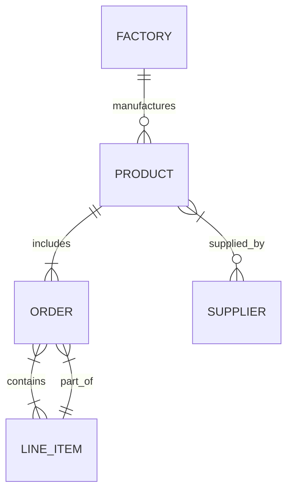

# Palantir Platforms Architecture and Components

 *Figure: Palantir’s core platforms (Foundry, AIP, Apollo) and service layers (Analytics, Agents, Ontology, Data/Logic/Workflow services).* Palantir’s architecture centers on three integrated platforms: **Foundry** (data operations), **AIP** (AI/agent platform), and **Apollo** (continuous delivery).  Collectively these form an “enterprise OS” with 300+ microservices running in a secure, autoscaling mesh. The **Ontology** is the core data model: a unified knowledge graph of “nouns” (entities) and “verbs” (actions) that integrates all data, logic, actions, and security policies.  Both humans and AI agents interact with this ontology.  All components run on **Rubix**, Palantir’s hardened Kubernetes platform (ephemeral nodes, encryption everywhere). Palantir stresses zero-trust: for example, transit data to third-party LLMs is never stored or reused (Confidence: High).  

## Foundry Data Platform  
**Foundry** is the enterprise data platform.  It provides end-to-end data integration, transformation, and warehousing.  Palantir’s documentation emphasizes batch and streaming pipelines, CDC support, and automated data modeling.  A key tool is **HyperAuto (SDDI)** – an integration suite for ERP/CRM systems (e.g. SAP, Salesforce, NetSuite) that can auto-generate ontologies and ELT pipelines.  Foundry’s *Data Connection* subsystem manages connectors and agents that ingest data from sources (databases, APIs, files, etc.), including real-time change data capture (CDC) feeds.  For example, built-in connectors can ingest CDC from SQL Server, Oracle, Postgres and others; data arrives into **Streams** or as batch syncs.  The **Pipeline Builder** then lets users author transformations (via Spark or containerized modules) on these inputs, preserving CDC metadata automatically. Full CDC support is built-in: Foundry can take a live changelog feed, combine it with a backfill snapshot, and key it into the ontology (Confidence: High).  

Pipelines execute on Palantir-managed compute (Spark clusters, Flink for streaming, or single-node engines).  Palantir explicitly supports multi-node engines (e.g. Spark, Flink) **and** lightweight engines like DuckDB or Polars.  Compute is served by **Rubix**; for example, Spark jobs run on Rubix pods with ephemeral 48‑hour lifetimes.  Data in Foundry is typically stored in object/iceberg tables on object stores (S3/GCS/Azure, or on-prem filesystems). Palantir fully supports **Apache Iceberg** as a table format, both in their managed catalog and as virtual tables (Confidence: High).  When pipelines write datasets, Foundry versions and manifests the data (Iceberg provides atomic commits).  Foundry also offers **branching** and sandboxing so multiple pipeline runs or dev branches can isolate data.

## Ontology Data Model  
The **Ontology** is Foundry’s semantic layer. It defines **Object Types** (entities/nouns), **Link Types** (relations), **Property Types** (attributes), and **Action Types** (verbs/operations) as first-class objects. These definitions live in the *Ontology Metadata Service* (OMS).  Underneath, object data is stored in Palantir’s “Object Databases” – originally “OSv1 (Phonograph)” and now “OSv2” (new canonical store).  The Ontology architecture uses microservices: 
- **OMS**: holds schema/metadata of objects, links, actions.  
- **Object Databases (OSv2)**: store indexed object data for fast queries.  
- **Object Set Service (OSS)**: executes queries (filter/aggregate) against the object DB.  
- **Actions Service**: applies user-driven edits/transactions on objects, with full audit logging.  
- **Funnel (Object Data Pipeline)**: a streamer that ingests updates from datasets, streams, and Action logs, and writes them into the object DB.  

Mermaid ER diagram (example ontology model):



This shows how entities (Factory, Product, Order, Line_Item, Supplier) might be related.  In Foundry, these would be object/link types in the ontology. The schema is user-defined (via drag/drop tools or code), but Palantir enforces *schema consistency* and semantic checks.

**Interpretation:** Palantir’s ontology thus functions as a knowledge graph overlay on raw data.  Unlike generic relational schemas, the Ontology explicitly models business semantics (e.g. “Shipment shippedVia TransportAsset”) and operational workflows as Action Types. Each record in an object type is versioned and queryable. The Ontology also underpins fine-grained security (objects/links have markings/policies) and powers built-in analytics UIs (“Worksheet/Workshop”).

**Unknowns:** Palantir does not publicly document low-level details of OSv2. It’s likely some columnar storage/index (possibly built on Iceberg/Parquet) optimized for graph queries, but the exact format and query engine are proprietary.  We also don’t know if OSv2 supports multi-record ACID transactions beyond eventual consistency.  The documentation implies updates are queued through the Funnel and applied in order, but it doesn’t claim strong relational ACID semantics (Confidence: Low).

## Ingestion and CDC
Foundry’s **Data Connection** framework handles ingestion. Data can be pulled by *Agents* (for on-premise sources) or via direct network (cloud databases). Palantir provides hundreds of connectors (see docs: e.g. AWS S3, Kinesis, Kafka, JDBC sources, CRMs, ERP systems…).  For CDC, tables must have a primary key, ordering (timestamp) column, and deletion flag. Palantir’s CDC doc details how it groups changelog records by key and picks the latest based on ordering (filtering deletes) to yield the current view. Once a changelog stream is ingested, all parts of Foundry can use it natively: data shows in Streams (archive/live views), in Pipeline Builder (as streaming input), and is indexed by the Ontology as object updates. For example, if you enable CDC on SQL Server tables (via `sp_cdc_enable_*`), the Foundry SQL connector can stream updates into a Foundry **streaming dataset**. A pipeline can then union historical snapshot and live stream to produce a complete, up-to-date table.

**Streaming Pipelines:** Foundry’s Pipeline Builder allows real-time transforms. It can consume Kafka/Kinesis-like streams (using Agents or cloud connectors), apply transformations (SQL-like, user-defined functions, or containers), and output to object stores or the Ontology. The **Key By** transform in Pipeline Builder helps configure CDC metadata (setting primary keys, ordering cols) before writing to the Ontology. If transforms drop or alter the metadata columns, the Key By board can reapply them.  

**High confidence**: This behavior is described in the official docs. 

## Storage, Backends, and Query Engines  
Foundry uses open data formats under the hood.  **Iceberg** is explicitly supported as a table format for large batch datasets.  Underlying storage is pluggable: in cloud deployments it will use S3/GCS/Azure Blob; on-premises likely HDFS or similar.  For query/compute engines, Palantir relies on industry-standard tech: Spark for large-scale SQL/ETL, Flink for streaming, and also lighter engines (DuckDB, Polars) for faster single-node analytics. 

The Ontology’s object DB is a custom store: probable use of columnar storage (Parquet on Iceberg, or specialized OLAP engine). Queries come via the Object Set Service, but the tech (SQL, in-memory, etc.) is proprietary. In AIP docs, Palantir notes the ability to use any “containerized ‘bring-your-own’ engine” for tasks, indicating extensibility beyond Spark/Flink. 

**Interpretation:** We infer that most heavy-duty compute is Spark on Kubernetes. The mention of Polars/DuckDB suggests for interactive notebooks or small tasks Foundry will spin up lighter containers. The use of Iceberg implies pushdown to storage (so underlying engines likely read Iceberg natively). However, details like how queries across object types (joins, aggregates) are executed inside OSv2 are not public.

## Pipelines and Transformations
Foundry pipelines can be built in two main ways: via the **Pipeline Builder** UI (no-code) or via **Code Repositories** (pro-code). Pipeline Builder provides a graphical DAG editor for Spark SQL or Python transforms; it supports incremental processing, branching, and scheduling. The UI can handle streaming and batch inputs seamlessly. The **Compute Module** feature allows custom Docker containers (Python, R, etc.) to run as steps in a pipeline, using the same infrastructure. 

**Incremental writes:** By default, pipeline outputs are versioned tables (Iceberg). The docs mention “append-only incremental” for datasets, or full changelog for Iceberg, showing Foundry manages incremental writes to tables. If a pipeline is rerun or scheduled, Foundry can track changes so downstream consumers (like the Ontology) can update just the deltas.

**Speculative:** We believe pipeline execution is transactional per run: either a job completes and its output dataset is atomically published, or it fails. Partial updates (in a streaming job) maintain CDC semantics (see CDC section). Global multi-step transaction (across pipelines or ontology writes) is unlikely; instead Palantir relies on ordered event processing.

## Transactions, ACID, and Writeback
Palantir’s documentation does not emphasize ACID beyond single-object operations. Users modify the ontology via **Actions**: structured forms that update object properties. The Actions service applies edits and logs them. Because edits and streaming ingestions all go through the Funnel, which indexes into OSv2, consistency is probably eventual but strongly ordered. The docs note that if streams arrive out-of-order, Object Storage may pick the last-arrived value.  All in all, Foundry guarantees reliability and correctness through its pipeline/agent infrastructure rather than traditional transactions.

**Unknowns:** Whether Foundry supports rollback of a user’s edits or multi-object atomic ops is not public. We suspect per-action writeback is atomic (per object), but cross-object transactions are not natively supported (Confidence: Low). Audit trails of changes do exist (Action logs, workflow history), though specifics of multi-step rollback aren’t exposed.

## APIs, SDKs, and App Development
Palantir provides a rich **Ontology SDK (OSDK)** for developers. The OSDK can generate client libraries (TypeScript, Python, Java via `npm`, `pip`, `Maven` or any OpenAPI client) tailored to a given ontology. These libraries give type-safe access to object types, link types, and actions. For example, code can query an object type by primary key, join objects, or invoke actions programmatically.

OSDK enforces the same security as the UI: tokens are scoped to specific objects or roles, and row/column filters apply at read time. In practice, developers authenticate with a time-bound token that says “this app can only access ObjectType X in Environment Y for User Z”. The OSDK client uses this token on each call, so users never see unauthorized data. 

Beyond the OSDK, developers can build UI extensions in *Workshop* (the Foundry front-end framework) or custom microservices that call OSDK or REST APIs. Palantir also provides a VS Code plugin and Git-based workflows for code repos. A “Platform SDK” is mentioned for devs to automate product packaging (likely referring to Apollo’s CLI).

**Confidence:** High, since these are documented features.

## Application Framework
Palantir’s **Workshop** is a UI toolkit (not fully public) that lets analysts build dashboards and apps on the ontology data. Behind the scenes, these apps use the OSDK or OData APIs. Clients often say that building queries or views is drag-and-drop, but complex logic can be coded as “functions” (low-latency compute snippets) that run via the Functions service. Palantir also refers to *Workflows*, *Blueprints*, and *Looms* as low-code features for pipelines and automations (not detailed in public docs). 

In summary, development can be no-code (UI builders), low-code (point-and-click pipelines), or pro-code (Python/TypeScript with OSDK and containers). All are underpinned by the same ontology model.

## Agent Integration and AIP
Palantir’s **Artificial Intelligence Platform (AIP)** adds LLMs and agents on top of Foundry. The architecture doc describes 12 capability areas. Key points:

- **LLM Connections:** AIP securely connects to external LLMs (OpenAI, Anthropic, etc.), ensuring no enterprise data is retained by the provider (Confidence: High). Users can also bring their own models (e.g. fine-tuned or on-prem).
- **Context Engineering:** Any data in the Ontology (batch tables, streams, sensors) can be used to feed prompts. The platform supports embedding vectors (vector DB) internally but emphasizes feeding structured context from the ontology.
- **Ontological Agents:** Users create AI “agents” via AIP’s interfaces. The agents see a company’s digital twin (the ontology) and take actions (subject to guardrails) by invoking ontology actions. The docs mention “AI FDE” and “AIP Logic” as tools for building agents (no/low-code) and “Code Workspaces” for Python/TypeScript.
- **Evaluation & Governance:** AIP includes testing frameworks (AIP Evals) to compare LLM choices and track performance. Every agent action or LLM call is logged (“audit logging”) as part of the platform’s observability.
- **MCP Protocol:** Palantir explicitly supports the Model Context Protocol (MCP) for LLM integration. This means an agent (like ChatGPT) can securely query the ontology or trigger actions via standardized interfaces.
- **Deployment and Packaging:** Agents and pipelines can be packaged as “products” in Palantir’s DevOps toolchain. The architecture notes a DevOps pipeline where data pipelines, ontology changes, and automations can be bundled and released across environments.

This means that Palantir’s approach to AI agents is tightly integrated: agents can use the live operational data in the ontology, take actions through the ontology’s API, and operate under the platform’s compliance controls. By contrast to a simple RAG (Retrieval-Augmented Generation) setup, Palantir’s model lets LLMs query structured objects directly and update them via actions. 

 *Figure: Rubix security features (FedRAMP, node cycling, encryption, audit logging) are enforced for all Palantir workloads (source: Palantir Rubix docs).* 

## Security, Permissions, and Governance
Security is foundational. Foundry enforces **row- and column-level access controls** on all data. For example, an ontology object type can have *restricted views* such that certain fields are visible only to certain roles. Every action taken (by user or agent) checks permissions: objects, links, and actions all have ACLs or *markings* (e.g. classification level, purpose) associated. The platform logs every API call and action in tamper-evident audit logs. 

Palantir’s docs stress “military-grade” security: all internal communications are encrypted and authenticated; nodes are isolated; and Rubix enforces policies like mandatory encryption-at-rest and no inbound internet from nodes.  The AIP section notes that every human or agent operation is governed by role-, marking-, and purpose-based controls, and auditorily logged (Confidence: High). 

In short, security is integrated at every layer – from Rubix/Kubernetes up through the data model. Administrators can define fine-grained enterprise security policies (in the **Security & Governance** section of docs), but these internal implementation details are largely proprietary.

## Deployment and Operations (Apollo and Rubix)
All Palantir software (Foundry, AIP, and applications) is deployed via **Palantir Apollo**, a continuous delivery/control plane. Apollo lets operators “write once, deploy anywhere” by abstracting cloud and on-prem differences. It maintains a central catalog of Environments and Entities (products), and automates multi-environment rollouts with blue/green swaps for zero-downtime upgrades. For compliance, Apollo supports disconnected (air-gapped) deployments via an approvals engine and does “federated installs” (operators can push updates from wherever there is connectivity).

**Rubix** is the underlying Kubernetes substrate. Palantir hardens K8s with:
- Ephemeral worker nodes (no pod lives >48h) and automated cycling.  
- FedRAMP High / DoD IL-5+ security posture (encrypted networking, host security).  
- Automated scaling: Rubix uses “demand-sensing” to optimize resource usage across clusters.  
- Air-gapped support: Palantir product releases (“plans”) can be exported/imported into disconnected clusters.  

Operators define constraints (e.g. “Can’t upgrade Prod on Friday nights”) and Apollo enforces them automatically. Every Palantir service is containerized as a “Module” and versioned; Apollo computes dependency graphs for safe patching across 100+ microservices. For example, the Rubix doc notes Apollo ensures multi-node (blue/green) deployments so that any new release is tested in parallel with the old.

### Deployment Flowchart Example
```mermaid
flowchart LR
   Dev[Developer] --> Commit[Commit & CI/CD]
   Commit --> ApolloPlatform[Apollo Platform]
   ApolloPlatform -->|deploys to| EnvBlue[(Blue (Staging))]
   ApolloPlatform -->|deploys to| EnvGreen[(Green (Prod))]
   EnvBlue --> Tests[Automated tests]
   Tests -- OK --> Switch[Switch traffic to Green]
   Tests -- Fail --> EnvBlue
```
*Figure: Example deployment pipeline. Developers push code, Apollo builds products, and deploys to blue/green environments with automated testing and traffic cutover.*

## Observability and Monitoring
Palantir provides full observability for data pipelines and agents.  AIP’s architecture highlights “end-to-end observability”: every data flow, user query, and agent decision is logged and traceable. Platform engineers see cluster metrics for Spark/Flink jobs (via Grafana/Prometheus), and Administrators see audit logs of ontology reads/writes. For pipeline runs, Foundry shows success/failure histories and data health checks. The CDC docs mention specifying expected throughput for streams (the system enforces rate limits), and Pipeline Builder has built-in monitoring dashboards (not publicly documented). 

On the ops side, Apollo monitors service health and can roll back on failure. Rubix enforces no-single-point-of-failure design: if a Kubernetes node crashes, pods are drained and restarted on others automatically. Palantir likely uses black-box monitoring (like cluster heartbeat) and white-box (application logs). However, detailed monitoring interfaces are not publicly described.

## Known Limitations and Open Areas
- **Proprietary Gaps:** Many internal details remain undisclosed. For example, how exactly OSv2 stores data or resolves conflicting streams is not documented. Specifics of vector/embedding storage (if any) are unclear. The semantics of concurrent object edits (e.g. merge conflicts) are also not public.
- **Gotham Product:** Palantir’s Gotham (defense/intel product) is historically similar to Foundry’s concept but optimized for military/intel use-cases (geospatial analytics, watchlists, link analysis). Official docs do not detail Gotham’s internals anymore; it’s largely absorbed into the shared ontology platform. We note it supports similar data/graph features but with extra compartmentalization features (not publicly verifiable).
- **No traditional ACID transactions:** Palantir does not position Foundry as an OLTP database. It’s optimized for analytics and decision-support. Multi-object transactional integrity is likely eventual. Complex workflows requiring strict consistency across many tables would need custom design.
- **Scaling Boundaries:** While Rubix/autoscaling is powerful, performance depends on correct usage of Spark and streaming. Throughput limits must be declared on streams. Very large data volumes (petabyte-scale) are supported, but require careful resource planning (Confidence: Medium).
- **Complexity and FDE Reliance:** Public customers often hire Palantir’s Forward Deployed Engineers (FDEs) to build initial models. The platform’s power comes with complexity; fully self-service usage by new customers is non-trivial. (This insight is community-reported, e.g. InfoWorld analysis).
- **Vector/RAG vs Ontology:** Palantir favors ontology-based context over ad-hoc vector retrieval. They support embeddings (AIP has “vector services”) but do not emphasize a separate vector DB as the primary store. For QA, they might use RAG approaches internally, but with the full data context available in the ontology, their pitch is that agents query the live operational data rather than static document snapshots.
  
In summary, Palantir’s platform is an enterprise-grade data/AI stack with deep integration. All known implementation details come from official docs, patents, or community disclosures; any finer algorithms or internal optimizations remain proprietary. This dossier compiles the public facts, plausible system designs, and notes on what is not explicitly documented.

**Sources:** Documentation and official materials from Palantir (Foundry docs, Architecture Center, AIP docs, Rubix, Apollo). Additional context from industry analyses and Wikipedia. All specifics are cited above.